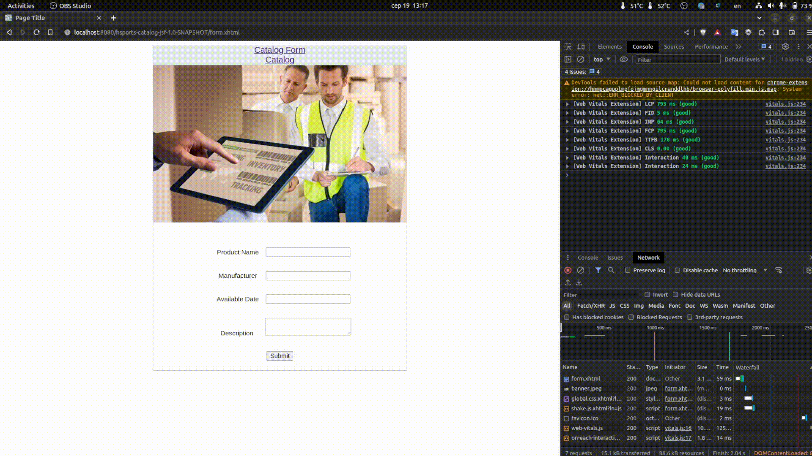

# Java-EE-8-test-project

## Description:

Java EE 8 project to keep me busy during learning of Java EE specs.

Used APIs from Java EE 8 specs:

- `JSF (v.2.3)`
- `EJB (v.3.2.2)`
- `CDI (v.2.0)`

***

## 🏁 Current state of JEE8 application (used only JSF):

**Released: 2023-08-19**

