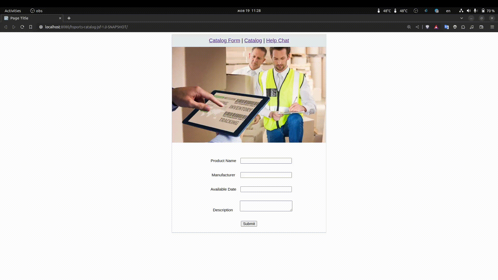

# Java-EE-8-test-project

## Description:

Java EE 8 mock project to keep me busy while learning Java EE specs. Simple catalog management system for choosing items from local or remote inventory and assigning them to the managers. 

Used APIs from Java EE 8 specs:

- `JSF (v.2.3)`
- `EJB (v.3.2.2)`
- `CDI (v.2.0)`
- `JAX-RS (v.2.1)`
- `Websockets (v.1.1)`
- `JSON-B (v.1.0)`
- `JSON-P (v.1.1)`
***

## 🏁 Current state of JEE8 application:

### Latest features:

- Item Manager (done via JAX-RS). Ability to assign a manager to a certain item (many-to-many relationship in MySQL
  table)
- Help Chat (Websockets API)

**Demo of a project: 2023-10-19**

